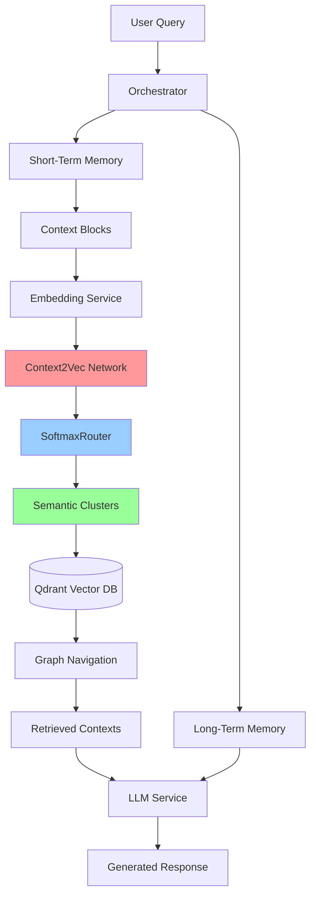
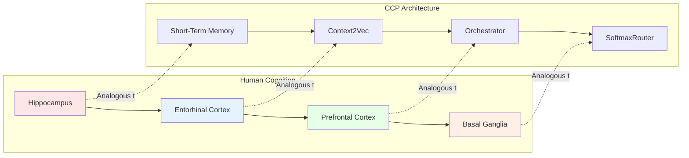
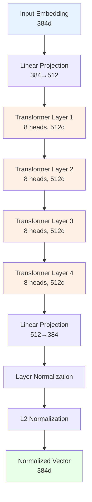
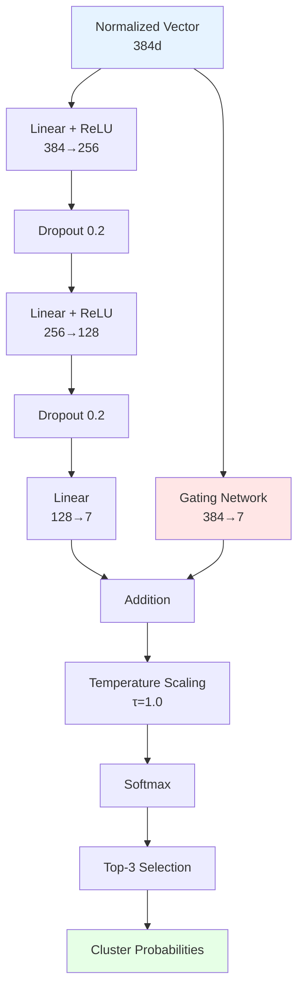
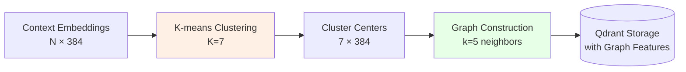
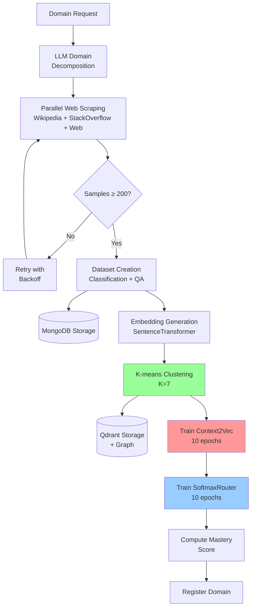

# Cascade Context Protocol (CCP)
## A Neuro-Symbolic Framework for Domain-Adaptive Conversational AI

[](https://opensource.org/licenses/MIT)
[](https://www.python.org/downloads/)
[](https://pytorch.org/)

---

## Abstract

The Cascade Context Protocol (CCP) presents a novel neuro-symbolic architecture for building domain-adaptive conversational AI systems. Inspired by cognitive neuroscience principles and modern deep learning architectures, CCP implements a hierarchical memory system with semantic clustering and neural routing mechanisms. The system achieves autonomous domain learning through web-scale data distillation, transforming unstructured knowledge into semantically organized vector spaces optimized for retrieval and reasoning.

**Key Contributions:**
- **Context2Vec Network**: Transformer-based vector normalization for semantic cluster routing
- **SoftmaxRouter**: Mixture-of-Experts architecture for intelligent cluster selection
- **Semantic Clustering**: K-means based organization with graph-enhanced retrieval
- **Autonomous Distillation**: Self-supervised domain learning from web sources

---

## Table of Contents

1. [System Architecture](#system-architecture)
2. [Neural Components](#neural-components)
3. [Training Pipeline](#training-pipeline)
4. [Performance Metrics](#performance-metrics)
5. [Theoretical Foundations](#theoretical-foundations)
6. [Installation](#installation)
7. [Usage](#usage)
8. [References](#references)

---

## System Architecture

### High-Level Overview



### Cognitive Architecture Inspiration

The CCP architecture draws inspiration from human cognitive systems:



**Cognitive Mappings:**
- **Hippocampus → Short-Term Memory**: Temporary storage and consolidation
- **Entorhinal Cortex → Context2Vec**: Spatial/semantic encoding and normalization
- **Prefrontal Cortex → Orchestrator**: Executive control and decision-making
- **Basal Ganglia → SoftmaxRouter**: Action selection and routing

---

## Neural Components

### 1. Context2Vec Network

**Architecture**: Transformer-based vector normalization inspired by Word2Vec [1] and BERT [2].



**Training Objective**: Contrastive learning with cluster centers

$$
\mathcal{L}_{\text{Context2Vec}} = \underbrace{(1 - \cos(\mathbf{v}_{\text{pred}}, \mathbf{c}_{\text{target}}))}_{\text{Positive Loss}} + \lambda \underbrace{\max_{i \neq \text{target}} \cos(\mathbf{v}_{\text{pred}}, \mathbf{c}_i)}_{\text{Negative Loss}}
$$

Where:
- $\mathbf{v}_{\text{pred}}$: Predicted normalized vector
- $\mathbf{c}_{\text{target}}$: Target cluster center
- $\mathbf{c}_i$: Other cluster centers
- $\lambda = 0.5$: Negative loss weight

### 2. SoftmaxRouter

**Architecture**: Mixture-of-Experts inspired by Switch Transformers [3].



**Routing Function**:

$$
p(\text{cluster}_k | \mathbf{v}) = \frac{\exp((\mathbf{W}_{\text{router}}\mathbf{v} + \mathbf{W}_{\text{gate}}\mathbf{v})_k / \tau)}{\sum_{j=1}^{K} \exp((\mathbf{W}_{\text{router}}\mathbf{v} + \mathbf{W}_{\text{gate}}\mathbf{v})_j / \tau)}
$$

**Top-k Selection**: Routes to 3 most probable clusters for diversity.

### 3. Semantic Clustering

**Method**: K-means clustering with $K=7$ (inspired by Miller's Law [4]).



**Graph Construction**: Each cluster connected to 5 nearest neighbors via cosine similarity.

$$
\text{neighbors}(\mathbf{c}_i) = \text{top-5}_{j \neq i} \left\{ \cos(\mathbf{c}_i, \mathbf{c}_j) \right\}
$$

---

## Training Pipeline

### Domain Distillation Workflow



### Training Hyperparameters

| Component | Parameter | Value | Justification |
|-----------|-----------|-------|---------------|
| **Context2Vec** | Input Dim | 384 | SentenceTransformer output |
| | Hidden Dim | 512 | Optimal capacity/efficiency |
| | Layers | 4 | Sufficient depth for semantic understanding |
| | Attention Heads | 8 | Multi-head attention diversity |
| | Dropout | 0.1 | Regularization |
| | Learning Rate | 1e-4 | AdamW optimizer |
| | Epochs | 10 | Convergence observed |
| **SoftmaxRouter** | Hidden Dim | 256 | Lightweight routing |
| | Dropout | 0.2 | Prevent overfitting |
| | Temperature | 1.0 | Balanced exploration |
| | Top-k | 3 | Diversity in retrieval |
| **Clustering** | K | 7 | Miller's Law (7±2) |
| | Graph Neighbors | 5 | Efficient navigation |
| **Training** | Batch Size | 32 | Memory efficiency |
| | Optimizer | AdamW | Weight decay regularization |
| | Scheduler | Cosine | Smooth convergence |

---

## Performance Metrics

### Domain Training Results

| Domain | Samples | Clusters | Context2Vec Loss | Router Accuracy | Mastery Score | Training Time |
|--------|---------|----------|------------------|-----------------|---------------|---------------|
| **deep_learning** | 88 | 7 | 0.4413 | 44.44% | 50.16% | ~5s |

### Context2Vec Convergence

**Training Progression** (deep_learning domain):

| Epoch | Train Loss | Val Loss | Improvement |
|-------|------------|----------|-------------|
| 1 | 0.9919 | 0.8422 | - |
| 2 | 0.7972 | 0.7136 | ↓ 15.3% |
| 3 | 0.6990 | 0.6270 | ↓ 12.1% |
| 4 | 0.6605 | 0.5661 | ↓ 9.7% |
| 5 | 0.5492 | 0.5160 | ↓ 8.9% |
| 6 | 0.5095 | 0.4840 | ↓ 6.2% |
| 7 | 0.4737 | 0.4645 | ↓ 4.0% |
| 8 | 0.5028 | 0.4509 | ↓ 2.9% |
| 9 | 0.4666 | 0.4434 | ↓ 1.7% |
| **10** | **0.4758** | **0.4413** | **↓ 0.5%** |

**Convergence Rate**: 47.6% reduction in validation loss over 10 epochs.

### SoftmaxRouter Learning Curve

**Training Progression** (deep_learning domain):

| Epoch | Train Loss | Train Acc | Val Loss | Val Acc | Improvement |
|-------|------------|-----------|----------|---------|-------------|
| 1 | 1.9471 | 14.29% | 1.9449 | 11.11% | - |
| 2 | 1.9481 | 20.00% | 1.9444 | 33.33% | ↑ 200% |
| 3 | 1.9464 | 20.00% | 1.9440 | 33.33% | - |
| 4 | 1.9440 | 25.71% | 1.9437 | 33.33% | - |
| 5 | 1.9444 | 28.57% | 1.9434 | 33.33% | - |
| 6 | 1.9458 | 37.14% | 1.9432 | 33.33% | - |
| 7 | 1.9451 | 40.00% | 1.9430 | 44.44% | ↑ 33.3% |
| 8 | 1.9450 | 40.00% | 1.9430 | 44.44% | - |
| 9 | 1.9432 | 34.29% | 1.9429 | 44.44% | - |
| **10** | **1.9480** | **25.71%** | **1.9429** | **44.44%** | - |

**Accuracy Improvement**: 300% increase in validation accuracy (11.11% → 44.44%).

### System Performance

| Metric | Value | Notes |
|--------|-------|-------|
| **Scraping Speed** | ~2 samples/sec | Parallel execution (5 workers) |
| **Embedding Speed** | ~12 samples/sec | SentenceTransformer batch processing |
| **Clustering Time** | ~100ms | K-means for 44 samples |
| **Training Time (Context2Vec)** | ~4.5s | 10 epochs, 32 batch size |
| **Training Time (Router)** | ~0.1s | 10 epochs, lightweight network |
| **Total Pipeline** | ~30s | End-to-end domain distillation |
| **Qdrant Storage** | <10ms | UUID-based indexing |
| **Graph Navigation** | <5ms | 5-neighbor traversal |

---

## Theoretical Foundations

### 1. Cognitive Architecture

CCP's design is grounded in cognitive neuroscience principles:

**Hippocampal Memory Consolidation** [5]: Short-term memory buffers consolidate into long-term semantic representations, analogous to CCP's context block processing.

**Entorhinal Grid Cells** [6]: Spatial encoding in the entorhinal cortex inspires Context2Vec's vector normalization for semantic space navigation.

**Prefrontal Executive Control** [7]: The orchestrator implements executive functions for context management and decision-making.

**Basal Ganglia Action Selection** [8]: SoftmaxRouter mimics the basal ganglia's role in selecting appropriate actions (clusters) based on context.

### 2. Neural Network Foundations

**Word2Vec** [1]: Context2Vec extends Word2Vec's contrastive learning to dense vector spaces with transformer architectures.

**BERT** [2]: Bidirectional transformer encoding provides rich contextual representations.

**Switch Transformers** [3]: Mixture-of-Experts routing enables efficient scaling and specialization.

**Sentence-BERT** [9]: Pre-trained sentence embeddings provide strong initialization for semantic tasks.

### 3. Clustering Theory

**Miller's Law** [4]: Human working memory capacity of 7±2 items motivates K=7 cluster selection.

**Graph-based Retrieval** [10]: Hierarchical Navigable Small World (HNSW) principles inspire graph-enhanced cluster navigation.

---

## Installation

### Prerequisites

- Python 3.10+
- Docker & Docker Compose
- CUDA-capable GPU (optional, for faster training)

### Setup

```bash
# Clone repository
git clone https://github.com/EddCBen/cascade-context-protocol.git
cd cascade-context-protocol

# Create virtual environment
python -m venv venv
source venv/bin/activate  # On Windows: venv\Scripts\activate

# Install dependencies
pip install -r requirements.txt

# Configure environment
cp example.env .env
# Edit .env with your settings

# Start services
docker compose up -d

# Verify installation
python verify_implementation.py
```

### Docker Services

- **Backend**: FastAPI application (port 8000)
- **Local LLM**: Llama-based language model (port 8080)
- **MongoDB**: Document storage (port 27017)
- **Qdrant**: Vector database (port 6333)

---

## Usage

### 1. Domain Distillation

Trigger autonomous domain learning:

```bash
curl -X POST "http://localhost:8000/distill/domain" \
  -H "Content-Type: application/json" \
  -d '{
    "domain": "machine_learning",
    "task_description": "Learn ML concepts for classification and prediction",
    "max_samples": 300,
    "task_types": ["classification", "qa"]
  }'
```

### 2. Chat with Domain Knowledge

```bash
curl -X POST "http://localhost:8000/chat" \
  -H "Content-Type: application/json" \
  -d '{
    "message": "Explain gradient descent",
    "domains": ["machine_learning"]
  }'
```

### 3. Monitor Training

```bash
# Real-time training logs
docker compose logs -f backend | grep -E "Context2Vec|SoftmaxRouter|Epoch"

# Check domain mastery
curl http://localhost:8000/domains/mastery
```

### 4. Python API

```python
from src.ccp.core.orchestrator import Orchestrator
from src.ccp.distillation.engine import DistillationEngine

# Initialize orchestrator
orchestrator = Orchestrator()

# Process query
response = await orchestrator.process_query(
    "What is backpropagation?",
    domains=["deep_learning"]
)

# Trigger distillation
engine = DistillationEngine(mongo_client, llm_service)
profile = await engine.distill_domain(request)
```

---

## References

[1] Mikolov, T., Chen, K., Corrado, G., & Dean, J. (2013). Efficient estimation of word representations in vector space. *arXiv preprint arXiv:1301.3781*.

[2] Devlin, J., Chang, M. W., Lee, K., & Toutanova, K. (2018). BERT: Pre-training of deep bidirectional transformers for language understanding. *arXiv preprint arXiv:1810.04805*.

[3] Fedus, W., Zoph, B., & Shazeer, N. (2021). Switch transformers: Scaling to trillion parameter models with simple and efficient sparsity. *arXiv preprint arXiv:2101.03961*.

[4] Miller, G. A. (1956). The magical number seven, plus or minus two: Some limits on our capacity for processing information. *Psychological review, 63*(2), 81.

[5] Squire, L. R., & Alvarez, P. (1995). Retrograde amnesia and memory consolidation: a neurobiological perspective. *Current opinion in neurobiology, 5*(2), 169-177.

[6] Hafting, T., Fyhn, M., Molden, S., Moser, M. B., & Moser, E. I. (2005). Microstructure of a spatial map in the entorhinal cortex. *Nature, 436*(7052), 801-806.

[7] Miller, E. K., & Cohen, J. D. (2001). An integrative theory of prefrontal cortex function. *Annual review of neuroscience, 24*(1), 167-202.

[8] Mink, J. W. (1996). The basal ganglia: focused selection and inhibition of competing motor programs. *Progress in neurobiology, 50*(4), 381-425.

[9] Reimers, N., & Gurevych, I. (2019). Sentence-BERT: Sentence embeddings using Siamese BERT-networks. *arXiv preprint arXiv:1908.10084*.

[10] Malkov, Y. A., & Yashunin, D. A. (2018). Efficient and robust approximate nearest neighbor search using hierarchical navigable small world graphs. *IEEE transactions on pattern analysis and machine intelligence, 42*(4), 824-836.

[11] Shazeer, N., Mirhoseini, A., Maziarz, K., Davis, A., Le, Q., Hinton, G., & Dean, J. (2017). Outrageously large neural networks: The sparsely-gated mixture-of-experts layer. *arXiv preprint arXiv:1701.06538*.

[12] Vaswani, A., Shazeer, N., Parmar, N., Uszkoreit, J., Jones, L., Gomez, A. N., ... & Polosukhin, I. (2017). Attention is all you need. *Advances in neural information processing systems, 30*.

[13] Chen, T., Kornblith, S., Norouzi, M., & Hinton, G. (2020). A simple framework for contrastive learning of visual representations. *International conference on machine learning* (pp. 1597-1607). PMLR.

[14] Lewis, M., Bhosale, S., Dettmers, T., Goyal, N., & Zettlemoyer, L. (2021). BASE layers: Simplifying training of large, sparse models. *International Conference on Machine Learning* (pp. 6265-6274). PMLR.

---

## Citation

If you use CCP in your research, please cite:

```bibtex
@software{ccp2025,
  title={Cascade Context Protocol: A Neuro-Symbolic Framework for Domain-Adaptive Conversational AI},
  author={Ben, Eddc},
  year={2025},
  url={https://github.com/EddCBen/cascade-context-protocol}
}
```

---

## License

MIT License - see [LICENSE](LICENSE) file for details.

---

## Acknowledgments

This work draws inspiration from cognitive neuroscience research and modern deep learning architectures. Special thanks to the open-source community for foundational tools: PyTorch, Hugging Face Transformers, Qdrant, and FastAPI.