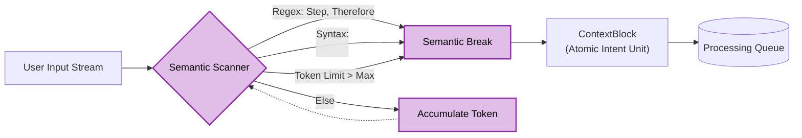
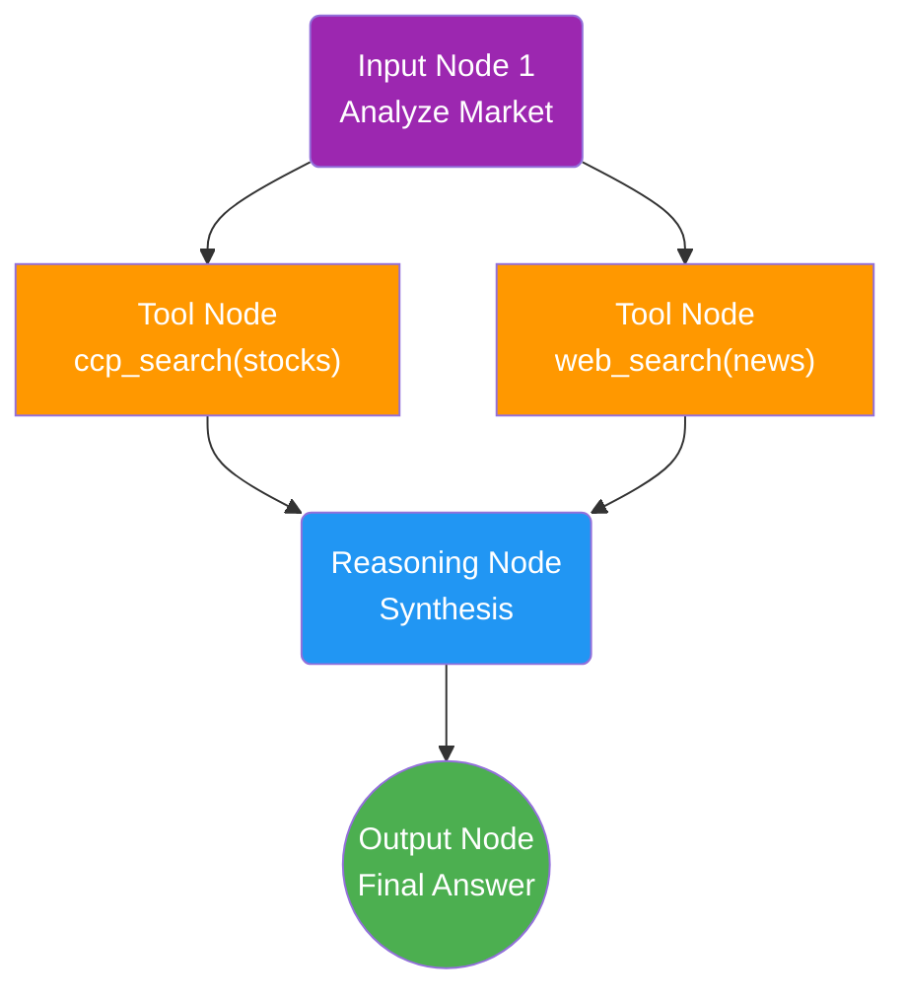
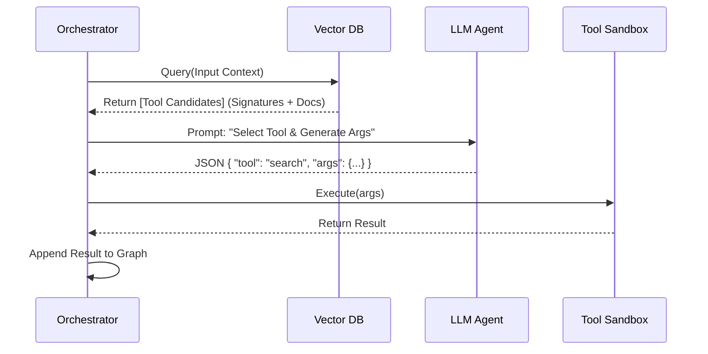
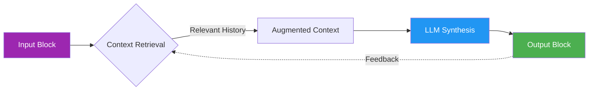
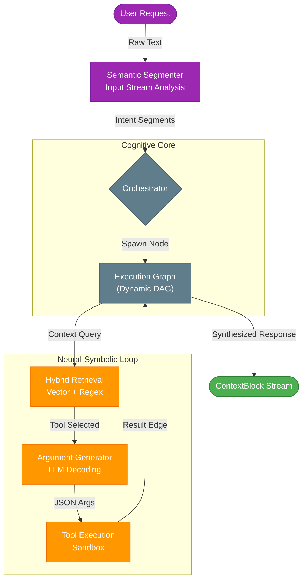

# Cascade Context Protocol (CCP): A Neuro-Symbolic Architecture for Infinite Context

**C Eddine Benarab**
*Arkiom Research*

[](https://opensource.org/licenses/MIT)
[](https://www.python.org/downloads/)
[]()

---

## 1. Abstract

The **Cascade Context Protocol (CCP)** proposes a novel architecture for extending the cognitive horizon of Large Language Models (LLMs) beyond the constraints of fixed-length context windows. By treating conversation not as a linear stream of tokens but as a **Directed Acyclic Graph (DAG)** of semantic intent, CCP enables "Infinite Context" through dynamic segmentation and recursive neuro-symbolic retrieval. This paper details the system's core mechanisms: **Semantic Input Segmentation**, the **Execution Graph Topology**, and the **ReAct Cognitive Loop**, demonstrating how they converge to create a transparent, agentic reasoning engine.

---

## 2. Introduction: The Linear Bottleneck

Contemporary Transformer architectures are bound by the quadratic complexity of their attention mechanisms, effectively limiting their context window. While "Long Context" models exist, they suffer from the "Lost-in-the-Middle" phenomenon. CCP addresses this by acting as a **middleware**, intercepting user input and decomposing it into atomic units of meaning before they ever reach the LLM. This allows the system to process massive datasets sequentially while maintaining a coherent, evolving global state.

---

## 3. Methodology

### 3.1 Semantic Input Segmentation

The first stage of the CCP pipeline is the transformation of unstructured text into structured **ContextBlocks**. Unlike fixed-size chunking strategies that arbitrarily split text every $N$ tokens, CCP employs a **Semantic Segmenter** (`SemanticChunker`) that respects the syntactic and logical boundaries of language.



The segmentation process follows a hierarchical heuristic:

1. **Semantic Markers**: The scanner looks for rhetorical indicators of thought transitions.
2. **Token Density**: Blocks are constrained by $\theta_{min}$ and $\theta_{max}$ limits.

$$
Block_i = f_{seg}(Stream_{input}) \text{ where } \text{Topic}(Block_i) \neq \text{Topic}(Block_{i+1})
$$

### 3.2 The Execution Graph (Topology)

Once segmented, each `ContextBlock` is transmuted into an **ExecutionNode**. The Graph allows for non-linear reasoning, where a single input can spawn parallel tool executions.



### 3.3 Neuro-Symbolic Function Calling

CCP exposes a "Glass Box" tool use mechanism. Instead of opaque function calling, the process is fully explicit.



### 3.4 Block Transformation (Input $\to$ Output)

The core loop transforms an Input ContextBlock into an Output ContextBlock through retrieval and synthesis.



---

## 4. Theoretical Framework: Infinite Context via Dynamic Graphing

The defining characteristic of CCP is its ability to handle **Infinite Context** without a linear increase in computational cost ($O(1)$ vs $O(N^2)$).

### The Sliding Window Paradox

Traditional LLMs require the *entire* conversation history to be present in the context window to maintain coherence. Euclidean geometry dictates that as history $H \to \infty$, Cost $C \to \infty$.

### The Graph Solution: State Decoupling

CCP solves this by fundamentally **decoupling Logical Context from Immediate Context**.

1.  **State Offloading**: Instead of forcing the LLM to hold the entire conversation state in its ephemeral VRAM (Context Window), CCP offloads the state to a persistent **Directed Acyclic Graph (DAG)** stored in a Vector Database. The Graph becomes the "Long-Term Memory" (Hippocampus), while the LLM's context window acts solely as "Working Memory" (Prefrontal Cortex).
2.  **Localized Processing**: When processing Block $B_t$, the system only retrieves the *top-k* most relevant nodes from the Graph. This ensures that the LLM's context usage is constant $O(k)$ regardless of the total conversation length $N$.
3.  **Why It Matters**: This allows the system to maintain a coherent persona and factual consistency over millions of tokens without suffering from "Lost-in-the-Middle" degradation or quadratic cost explosion.

$$
Context(LLM_t) = B_t + \sum_{k=0}^{K} Sim(B_t, Graph_{history})
$$

### 4.1 Future Work: Infinite Throughput via Parallelism

While the current implementation processes `ContextBlocks` sequentially for stability, the architecture is designed for **Massive Parallelism**.

Because text is segmented into atomic, self-contained units of intent ($B_1, B_2, ..., B_n$), they can theoretically be processed by $N$ separate LLM instances simultaneously.

**Theoretical Latency Impact:**

*   **Sequential (Current)**: $T_{total} = \sum_{i=1}^{N} T(B_i)$
*   **Parallel (Future)**: $T_{total} = \max(T(B_i)) + T_{merge}$

This shift would reduce the latency of processing a 100-page document from minutes to seconds, effectively providing **Infinite Throughput** alongside Infinite Context.

---

## 5. Architecture & Data Flow

The following diagram illustrates the transformation of a User Request into an internal Graph State and back to the Client.



---

## 5. Launch Instructions

### Prerequisites

* **Docker** & **Docker Compose**

### Quick Start

Initialize the entire neuro-symbolic stack (Backend, Vector DB, Dashboard):

```bash
docker-compose up --build
```

**Access Points:**

* **Live fMRI Dashboard**: [http://localhost:8000/dashboard](http://localhost:8000/dashboard)
* **API Endpoint**: [http://localhost:8000](http://localhost:8000)

### Scientific Verification (The Dashboard)

To verify the system's agency, access the **Live Dashboard**. This interface is not a chat app; it is a visualization of the `ExecutionGraph`.

1. **Submit a complex query**: *"Research the history of Transformers and summarize the key papers."*
2. **Observe**:
   * **Segmentation**: The input splits into "Research history" and "Summarize papers".
   * **Branching**: The system spawns multiple `ccp_search` nodes.
   * **Convergence**: The separate streams merge into a final `Output Node`.
   * **Physics**: The nodes repel and cluster organically, visualizing the "shape" of the thought process.

---

## 6. Citation

```bibtex
@software{ccp2025,
  title={Cascade Context Protocol (CCP): A Neuro-Symbolic Architecture for Infinite Context},
  author={Benarab, C Eddine},
  year={2025},
  url={https://github.com/EddCBen/cascade-context-protocol}
}
```

## 7. License & Commercial Usage

**Creative Commons Attribution-NonCommercial 4.0 International (CC BY-NC 4.0)**

### Research & Non-Commercial Use

You are free to:

* **Share** — copy and redistribute the material in any medium or format.
* **Adapt** — remix, transform, and build upon the material.

**Under the following terms:**

* **Attribution** — You must give appropriate credit, provide a link to the license, and indicate if changes were made.
* **Non-Commercial** — You may not use the material for commercial purposes (profit-generation, commercial product integration, etc.).

### Commercial Usage

If you wish to use the **Cascade Context Protocol** for commercial purposes, including but not limited to:

* Integrating CCP into a paid software service (SaaS).
* Using CCP for proprietary enterprise tools.
* Selling products derived from this architecture.

**You MUST obtain a Commercial License.**

charafeddineben@gmail.com

[View Full License](LICENSE)
