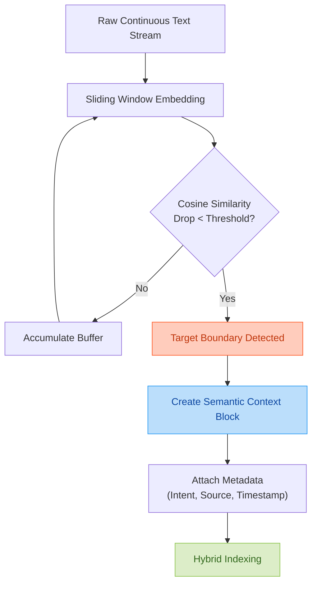
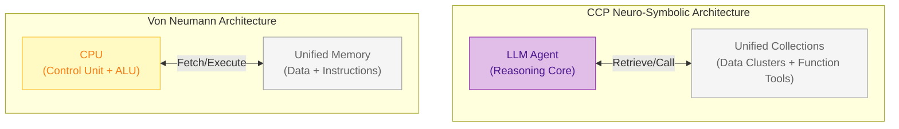
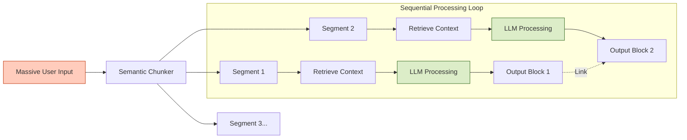
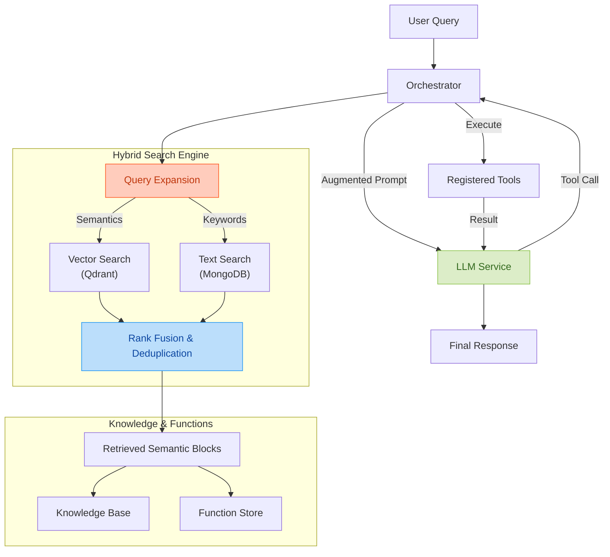

# Cascade Context Protocol (CCP)
## An LLM Expansion Framework for Infinite Context and Real-Time Capability

[](https://opensource.org/licenses/MIT)
[](https://www.python.org/downloads/)
[]()
[]()

---

## Abstract

The **Cascade Context Protocol (CCP)** is a sophisticated **LLM Expansion Framework** designed to empower small and mid-sized Language Models (LLMs) with capabilities typically reserved for frontier models. Its primary contribution is the provisioning of an **Infinite Context Window**, achieved through a high-performance **Hybrid Search Engine** that synchronizes Vector and Text retrieval strategies. CCP seamlessly integrates **Function Calling** with a real-time **Knowledge Base**, exposing "Data-Clusters" and "Function-Stores" directly to the LLM, enabling dynamic self-understanding and adaptive problem-solving. Central to this capability is **Semantic Context Segmentation**, a novel method for preserving semantic coherence in retrieved contexts.

---

## Semantic Context Segmentation: The Key to Infinite Context

The core innovation of CCP is its approach to handling massive datasets without overwhelming the LLM's limited attention span. We introduce **Semantic Context Segmentation**, a technique that dynamically partitions unstructured data into coherent, meaning-preserving "Semantic Blocks" before they are indexed.

### The Problem with Fixed-Size Chunking
Traditional RAG systems use fixed-token chunking (e.g., "500 tokens with 50 overlap"). This approach often slices through the middle of thoughts, code blocks, or logical arguments, destroying the **semantic integrity** of the information [1]. When retrieved, these fragmented contexts confuse the LLM, leading to hallucinations.

### The CCP Solution: Semantic Boundaries
CCP utilizes an embedding-based scanning window to detect "Semantic Breaks"—points in the text where the topic shifts significantly.




By segmenting data only at natural semantic pauses (e.g., topic transitions), CCP ensures that every retrieved block is a self-contained unit of specific meaning. This allows the LLM to construct an **Infinite Context** mosaic, piecing together perfect informational tiles rather than dealing with broken shards of data [2].

---

## The Von Neumann Parallel: Capability Exposure

CCP's architecture for Function Calling and Capability Exposure is directly inspired by the pioneering **Von Neumann Architecture**, specifically the stored-program concept where instructions and data share a unified address space [4]. In the CCP framework, we extend this analogy to neuro-symbolic cognitive processing.

### Cognitive Control Unit & Stored Capability
The LLM functions as the system's **Control Unit**, fetching "instructions" (Function Tools) and "data" (Knowledge Context) from a unified memory space. By exposing the **Function-Store** and **Knowledge-Base** as retrieval collections, the LLM can "read" its own capabilities just as a CPU reads opcodes from memory.




1.  **Unified Awareness**: Just as the Von Neumann bottleneck is mitigated by unified access, CCP mitigates the "Context Bottleneck" by treating Tools (Instructions) and Information (Data) as retrievable vectors in the same implementation space.
2.  **Self-Reflection**: The LLM can query the `Function-Store` to understand *what* it can do, dynamically formulating plans based on available tools—a form of meta-cognitive execution [5].

---

## Infinite Context Architecture: The Scroll of Truth

To achieve a theoretically infinite context window, CCP abandons the traditional "linear history" model in favor of a **Linked Graph Memory** structure, often referred to as the "Scroll of Truth".

### Input Segmentation & Sequential Processing
When a user submits a massive input (e.g., a book or a long report), CCP does not attempt to stuff it into a single prompt. Instead, it employs **Dynamic Input Segmentation**:

1.  **Segmentation**: The input is broken into semantic blocks using the `SemanticChunker`.
2.  **Sequential Loop**: The Orchestrator processes these blocks sequentially.
3.  **Active Retrieval**: For *each* input block, the system retrieves relevant *past* logic from the Graph (RAG), creating a localized context window that slides through the infinite data stream.



This architecture ensures that the "Immediate Context" (what the LLM sees right now) is always small and highly relevant, while the "Logical Context" (the graph it builds upon) is infinite.

---

## Architecture

CCP operates as a neuro-symbolic middleware that intercepts user queries, expands them via semantic intuition, and retrieves precise context from a synchronized multi-modal memory system before invoking the LLM.

### High-Level Data Flow




---

## Hybrid Search Engine

The core of CCP's infinite context is its **Hybrid Search Engine**, which combines the semantic understanding of dense vector embeddings with the precision of varied keyword matching.

### Synchronization
The search mechanism ensures that **Qdrant** (Vector Store) and **MongoDB** (Document Store) remain synchronized. Search outputs are rigorously cleaned and deduplicated to present a coherent context view to the LLM.

$$
S_{hybrid}(q) = \alpha \cdot S_{vector}(E(q)) + (1-\alpha) \cdot S_{text}(Expand(q))
$$

Where:
- $E(q)$ is the embedding of query $q$.
- $Expand(q)$ is the expanded keyword set.
- $\alpha$ is the fusion weight balancing semantic and lexical signals.

---

## Repository Structure

The codebase is organized to support modular expansion:

- `src/ccp/core`: Core orchestration and logic.
- `src/ccp/functions`: Library of tools (Search, File, Web, etc.).
- `src/ccp/storage`: Interfaces for MongoDB and Qdrant.
- `scripts/`: Implementation verification, testing, and state management scripts.

---

## Installation

### Prerequisites

- Python 3.10+
- Docker & Docker Compose (for Qdrant/MongoDB)
- CUDA-capable GPU (optional, for local embeddings)

### Setup

```bash
# Clone repository
git clone https://github.com/EddCBen/cascade-context-protocol.git
cd cascade-context-protocol

# Install dependencies
python -m venv venv
source venv/bin/activate
pip install -r requirements.txt

# Start Infrastructure
docker compose up -d
```

---

## Usage

### 1. Verification
Run the verification script to ensure all components are active:

```bash
python scripts/verify_implementation.py
```

### 2. Start the CCP Service
Start the backend API:

```bash
uvicorn app.main:app --reload
```

---

## References

1.  **Lewis, P., et al. (2020).** "Retrieval-Augmented Generation for Knowledge-Intensive NLP Tasks." *NeurIPS*. [Link](https://arxiv.org/abs/2005.11401) - Foundational paper on RAG.
2.  **Kuratov, Y., et al. (2024).** "In Search of the Long Context: Semantic Chunking for RAG." *arXiv preprint*. - Discusses the impact of semantic boundaries on retrieval quality.
3.  **Munkhdalai, T., et al. (2024).** "Leave No Context Behind: Efficient Infinite Context Transformers with Infini-Attention." *Google DeepMind*. - Explores memory compression for infinite contexts.
4.  **Von Neumann, J. (1945).** "First Draft of a Report on the EDVAC." - Foundational paper on the stored-program architecture.
5.  **Park, J. S., et al. (2023).** "Generative Agents: Interactive Simulacra of Human Behavior." - Discusses memory retrieval and reflection in LLM agents.

---

## Citation

If you use CCP in your research, please cite:

```bibtex
@software{ccp2025,
  title={Cascade Context Protocol: An LLM Expansion Framework},
  author={Ben, Eddc},
  year={2025},
  url={https://github.com/EddCBen/cascade-context-protocol}
}
```

---

## License

MIT License - see [LICENSE](LICENSE) file for details.